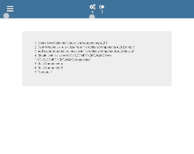

# logiX-tour
A user onboarding library written in pure JavaScript

Currently Supports:
* React
* Theoretically this should work with any require library



### Quick Start
     npm install --save logix-tour

> Set an indicator by adding a class of {_your-prefix_}-tour (i.e. my-app-tour)

> Set pop up text by adding a [data-tour-text] attribute

> Run tour.runMe(_prefix_) (i.e. tour.runMe('my-app'))

---

### Usage In React

```javascript
  import tour from 'logix-tour';

  class App extends Component {
    componentDidMount() {
      // SET THE "APPEND TARGET" TO THE ID OF YOUR ELEMENT
      tour.setConfig({ appendTarget: 'My_Awesome_List' });
      // CALL "RUN ME" WITH YOUR DESIRED PREFIX
      tour.runMe('mal')
    }
    render() {
      return (
        <div id="My_Awesome_List">
          <ul
            className="mal-tour"
            data-tour-text="Awesome pop up text here"
          >
            <li>Waffles</li>
            <li>Pancakes</li>
            <li>Butter</li>
            <li>Syrup</li>
          </ul>
        </div>
      )
    }
  }
```
---
## Methods

### runMe(_prefix_, _title_)

Use this to initialize your onboarding

* prefix
> this will run the tour on all elements with a class name of {prefix}-tour

* title
> this will set a title for the tour group you are about to run

### killTour(_prefix_)

This will remove all indicators for a particular Group

* prefix
> this will remove all indicators that where initialized with the same prefix

### setConfig(_config_object_)

Use this method to set global configs

Current config options
> * appendTarget

> * tap

> * dismiss

```javascript
  import tour from 'logix-tour';

  const config = {
    appendTarget: 'app', // your root element, defaults to document.body
    tap: true, // runs the "tap" animation, defaults to false
    dismiss: function () { console.log('dismiss it'); }, // set a callback to dismiss pop ups
  }

  tour.setConfig(config);
```

## COMING UP
- Angular support
- More config options;
